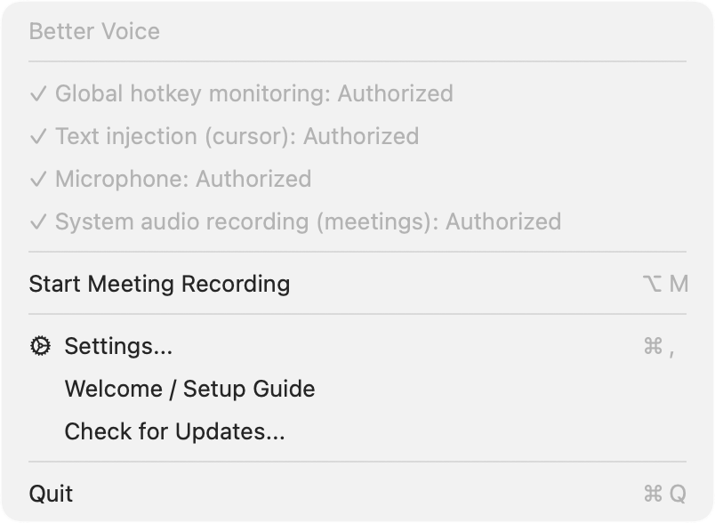
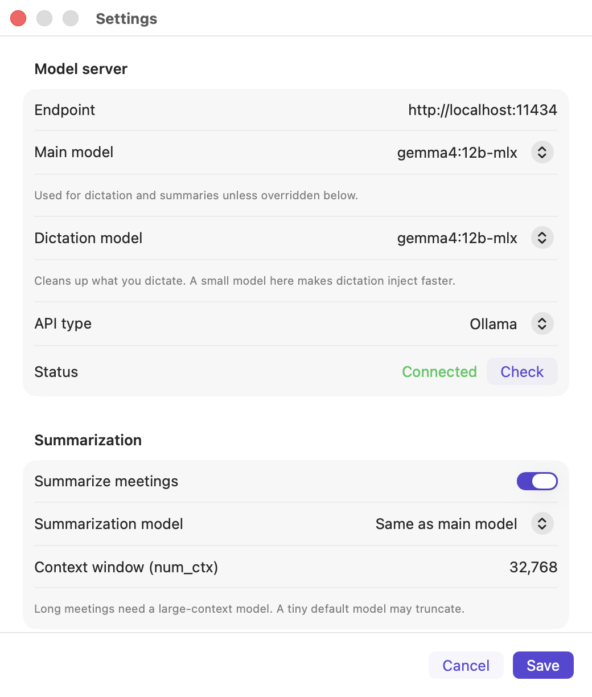

# Better Voice

**Private, on-device voice for your Mac.** Dictate into any app, and turn meetings into speaker-labeled transcripts with AI summaries — all processed locally, personalized to you, and pointed at whatever model *you* choose.

[](https://github.com/drkpxl/better-voice/releases/latest)
[](https://github.com/drkpxl/better-voice/releases/latest)
[](LICENSE)
[](https://github.com/drkpxl/better-voice/releases/latest)
[](https://github.com/drkpxl/better-voice/actions/workflows/ci.yml)

> Built on Apple **SpeechAnalyzer** (macOS 26) for on-device transcription, with a **local LLM** (Ollama or any OpenAI-compatible endpoint) for cleanup and summaries. Your audio never leaves your Mac.

---

## Why Better Voice

Most dictation apps stop at "speech → text." Better Voice adds two things almost nobody else does:

- **It knows your world.** A plain-text `personal-context.md` — who you meet with, your role, your jargon — is injected into the cleanup *and* summary prompts, so "latency ess-ell-ohs for the cue three roadmap" comes out as "latency SLOs for the Q3 roadmap."
- **It runs on your terms.** Fully on-device by default. Point it at local Ollama or any OpenAI-compatible endpoint, pick your own model.

Free, open source, no accounts, no telemetry.

---

## Features

<p align="center">
  
  
</p>

### 🎙️ Dictation
- Global hotkey (default **Right Option**) → on-device transcription → optional LLM polish → text typed at your cursor in **any app**.
- **Live waveform** indicator (notch-aware) and subtle start/stop sounds so you always know it's listening.

### 📝 Meeting transcription & notes
- **Captures the whole conversation** — microphone **and** system audio (Zoom, Teams, Meet, anything playing), or either one. No bot joins your call. Uses a lightweight **Core Audio process tap** (needs only *System Audio Recording* consent — not full Screen Recording).
- **Speaker diarization** via [FluidAudio](https://github.com/FluidInference/FluidAudio): your own voice (the mic) is labeled **"You"** automatically, and the other participants are separated per-voice; rename any of them in the post-meeting wrap-up.
- **AI summaries that fit the meeting.** Better Voice classifies the meeting (**1:1 / standup / general**) and uses a matching summary template — decisions, action items, and the points that actually matter — with your personal context mixed in.
- When you stop, exports a clean `transcript.md` + `-summary.md` to `~/.better-voice/meetings/`.

### 🧠 Personalized to you
- `~/.better-voice/personal-context.md` — free-text Markdown you edit by hand. No schema, no fine-tuning, no GPU. Carries meaning, not just spellings, and powers both cleanup and summaries.

### 🔒 Local & private
- Transcription runs on-device. Polishing/summaries talk **only** to the local or self-hosted model endpoint you configure.
- No analytics, no cloud accounts, no data leaves your machine.

### 🛠️ Yours to shape
- Use **Ollama** or **any OpenAI-compatible API** (with an API key). Bring your own model.
- Menu-bar app with **first-launch onboarding**, a full **Settings** window, config **hot-reload**, and **in-app auto-updates** (Sparkle).

---

## Install

1. Download the latest **`.dmg`** from [Releases](https://github.com/drkpxl/better-voice/releases/latest) and drag **Better Voice** to Applications.
2. First launch is Gatekeeper-blocked (self-signed build). Clear the quarantine flag, then open it:
   ```bash
   xattr -cr /Applications/BetterVoice.app
   ```
3. The **welcome screen** walks you through permissions, your dictation hotkey, the meeting save folder, your model server, and personal context.

Future updates install automatically via the in-app updater (or **Check for Updates…** in the menu).

### Requirements
- **macOS 26+**, Apple Silicon.
- A local model server for cleanup & summaries (recommended): [Ollama](https://ollama.com) with a general ~4B model (default `qwen3.5:4b-mlx`). Polish is optional — raw transcription works without it. See the [Ollama guide](https://drkpxl.github.io/better-voice/ollama.html).

### Permissions
Granted during onboarding, or in **System Settings → Privacy & Security**:

| Permission | Why | Required? |
|---|---|---|
| **Accessibility** | Detect the hotkey and inject text into the active app | Required |
| **Input Monitoring** | `CGEventTap` needs it to see the Right Option key globally | Required |
| **Microphone** | Capture your voice | Required |
| **System Audio Recording** | Capture the *other side* of meetings | Meetings only |

> **Note:** Input Monitoring is the permission the global hotkey actually needs — Accessibility alone isn't enough, and many tools miss this.

---

## Usage

**Dictation** — Press **Right Option** to start, speak, press again to stop. The polished text is typed into the focused app.

**Meeting** — Press **Right Option+M** (or menu bar → **Start Meeting Recording**). Your own voice is labeled **"You"** and the other participants are separated automatically. When you stop, optionally rename the other speakers in the wrap-up window, and Better Voice writes the transcript + a type-aware summary to `~/.better-voice/meetings/`. Use headphones for the mic+system ("both") mode so the other participants' voices don't leak back into your microphone.

---

## How it works

```
Press hotkey
  → On-device transcription (Apple SpeechAnalyzer)
  → LLM polish (optional) — Ollama or OpenAI-compatible
     + personal-context.md injected into the prompt
  → Inject at cursor
  → Local history (voice-history.jsonl / audio) for debugging
```

Meeting mode adds mic + system-audio capture, live per-segment polish, and **per-channel** diarization at stop (the mic is deterministically "You"; the system channel is diarized offline by FluidAudio's VBx pipeline over the recorded WAV and merged onto one speaker timeline), plus speaker renaming, meeting-type classification, and a summary pass — all on-device.

---

## Configuration

Config lives at `~/.better-voice/config.json` and **hot-reloads** on save. All keys are optional and fall back to sensible defaults.

```json
{
  "server": {
    "endpoint": "http://localhost:11434",
    "api": "ollama",
    "model": "qwen3.5:4b-mlx",
    "summarization_model": "qwen3.5:4b-mlx"
  },
  "polish": {
    "enabled": true,
    "personal_context_enabled": true
  },
  "meeting": {
    "audio_source": "both",
    "auto_delete_audio": false,
    "default_type": "general"
  }
}
```

Point `server` at any OpenAI-compatible API instead of Ollama:

```json
"server": {
  "endpoint": "https://api.example.com/v1/chat/completions",
  "api": "openai",
  "model": "gpt-4o-mini",
  "api_key": "sk-..."
}
```

Full reference (every key, meeting/summarization sub-options, hotkey settings): **[docs/configuration.md](docs/configuration.md)**.

Other files in `~/.better-voice/`:
- `personal-context.md` — your free-text background (see above).

---

## Privacy

Better Voice keeps your audio and text on your own machine. Recordings are transcribed on-device; polishing and summarization talk only to the local (or self-hosted) endpoint you configure. There are no analytics and no cloud accounts. Local `*.jsonl` history and `audio/*.wav` files are written purely as debugging artifacts and can be auto-deleted after transcription.

---

## Roadmap

Honest about what's *not* here yet:

- **Broader macOS support** — an alternate on-device engine (FluidAudio/Parakeet) to run below macOS 26.
- **MCP / CLI** — let AI agents (Claude Code, Cursor, Codex) search your transcripts and trigger dictation.
- **Cross-meeting speaker recognition** — remember a named voice across future meetings.
- **Multilingual** — Better Voice is English-first today.

Removed in 1.0: Remote Voice (Windows → Mac over Tailscale), ambient always-listening mode, and the correction dictionary — see git history if you need them back.

Ideas and PRs welcome.

---

## Development

```bash
cd client
make build      # Compile
make run        # Dev mode
make install    # Install to /Applications
make uninstall  # Remove
```

Pure-logic code lives in the Foundation-only `BetterVoiceCore` library with unit tests, isolated from the Speech / audio-capture surface.

---

## Credits & License

Began as a fork of [Marvinngg/ambient-voice](https://github.com/Marvinngg/ambient-voice) and has diverged substantially — most notably, the self-training / QLoRA fine-tuning pipeline was replaced (v0.3.0) with prompt-based personalization (`personal-context.md`). Waveform rendering adapted from [zachlatta/freeflow](https://github.com/zachlatta/freeflow) (MIT). Diarization by [FluidAudio](https://github.com/FluidInference/FluidAudio). Updates via [Sparkle](https://sparkle-project.org).

Licensed under the **MIT License** — see [LICENSE](LICENSE).
